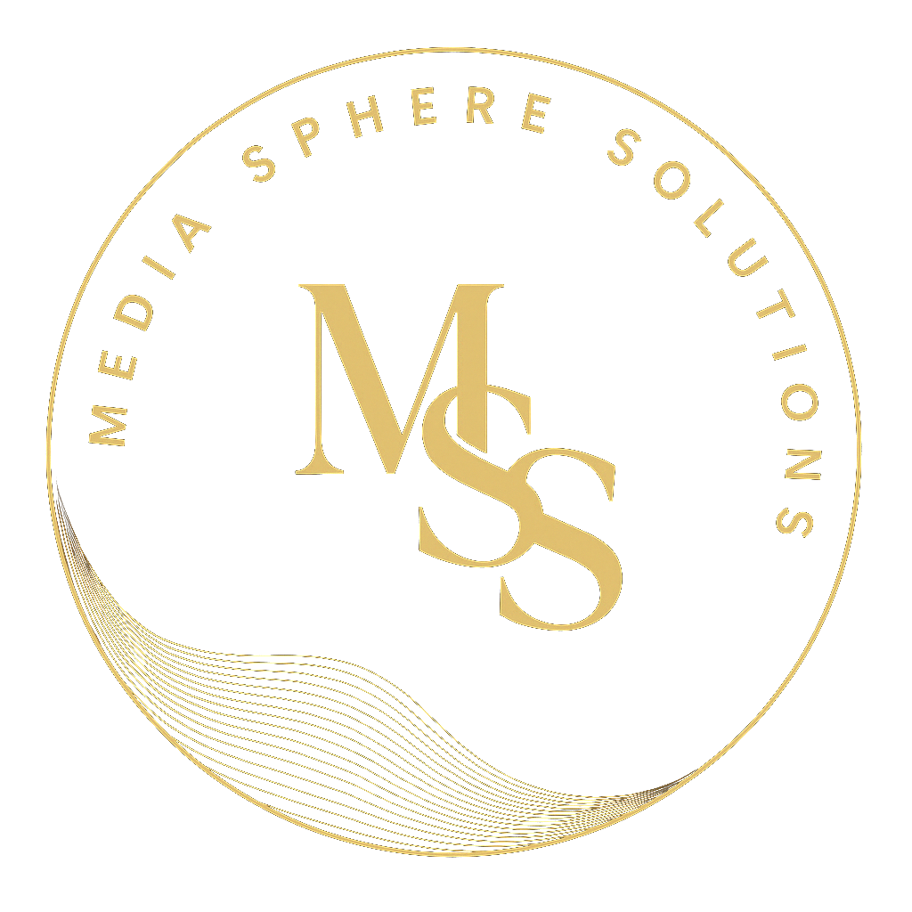

# Media Sphere Solutions

## Overview

Media Sphere Solutions is a professional marketing agency website that offers premium marketing automation and growth strategy services for ambitious brands. This repository contains the complete source code for the [Media Sphere Solutions](https://mediaspheresolutions.com) website.

## Features

- **Modern, Responsive Design**: Fully responsive design that works seamlessly across desktop, tablet, and mobile devices
- **Interactive UI Elements**: Smooth scrolling, animated sections, and interactive components
- **Vanta.js Background**: Dynamic 3D globe animation in the hero section
- **Contact Form Integration**: Integrated contact form with Formspree

## Technologies Used

- **HTML5**: Semantic markup structure
- **CSS3**: Modern styling with CSS variables, flexbox, and grid layouts
- **JavaScript**: Vanilla JS for core functionality
- **Libraries**:
  - Vanta.js & Three.js: For the 3D globe animation
  - Font Awesome: For iconography
  - AOS: For scroll animations

## Project Structure

The website includes the following key sections:

1. **Hero**: Eye-catching introduction with 3D globe animation
2. **Services**: Marketing services offered including Growth Strategy, Marketing Automation, Performance Marketing, and Brand Development
3. **Process**: Four-step methodology explaining the company's approach
4. **Approach**: Differentiation factors and industries served
5. **Team**: Team member profiles with links to their professional profiles
6. **Contact**: Contact form and business contact information

## Browser Compatibility

- Chrome, Firefox, Safari, Edge, Opera (latest versions)
- Mobile browsers (iOS Safari, Android Chrome)

---

© 2025 Media Sphere Solutions. All rights reserved.
